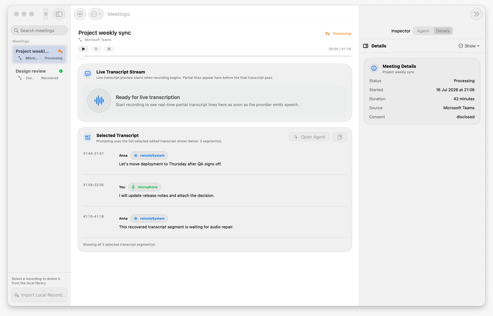
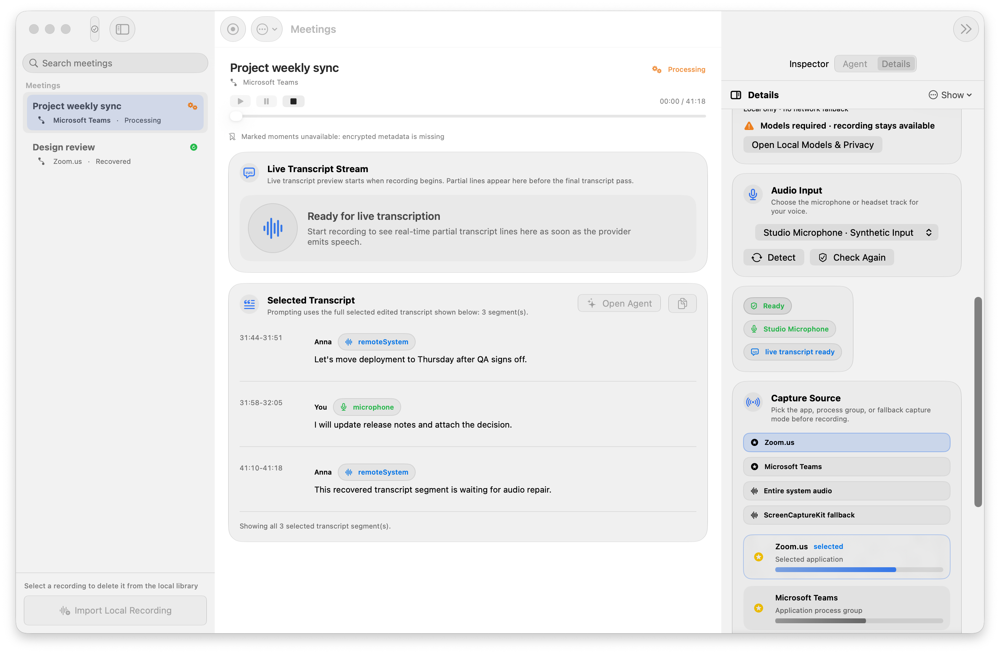
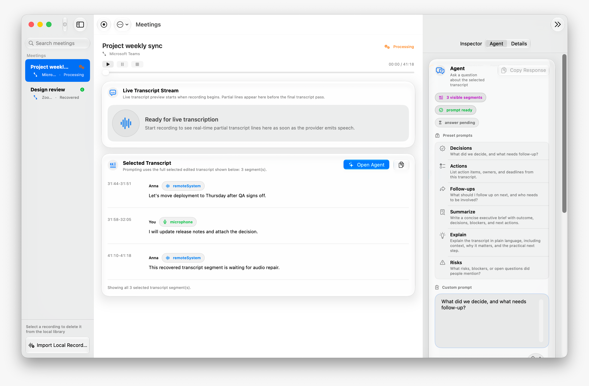
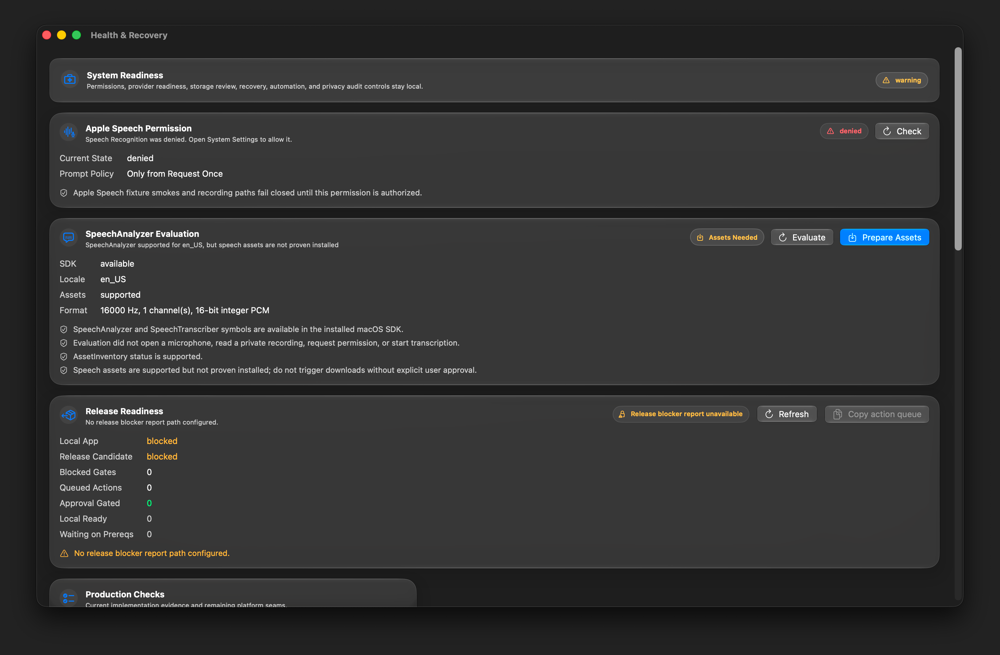
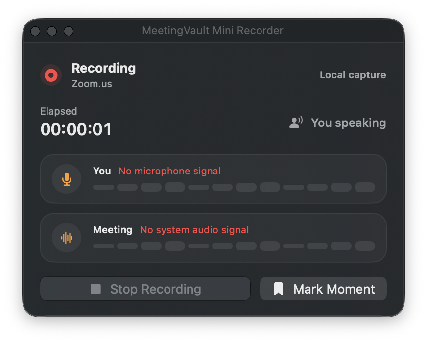
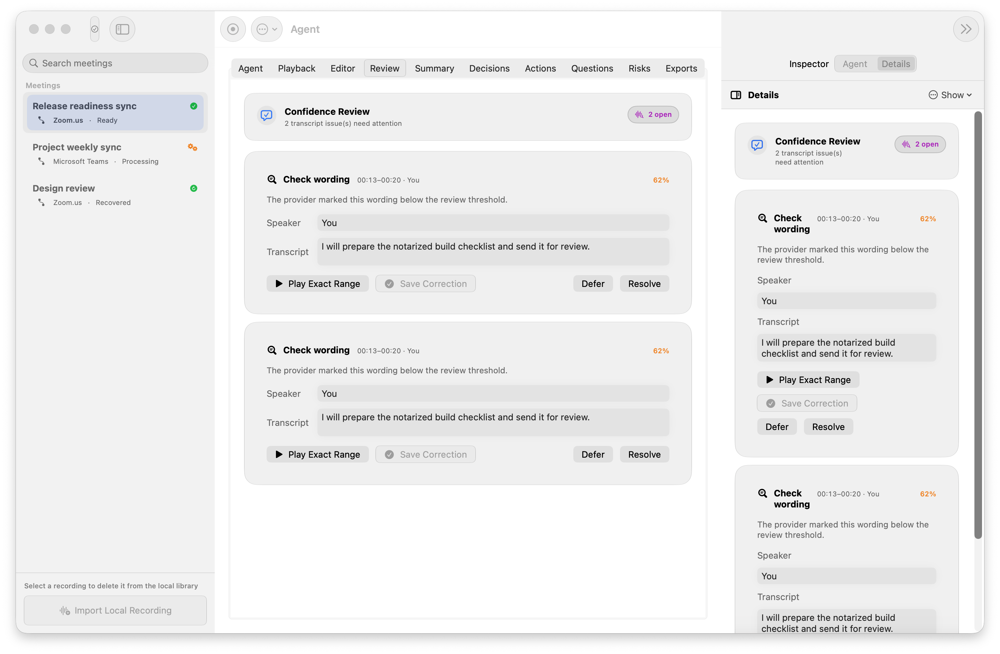
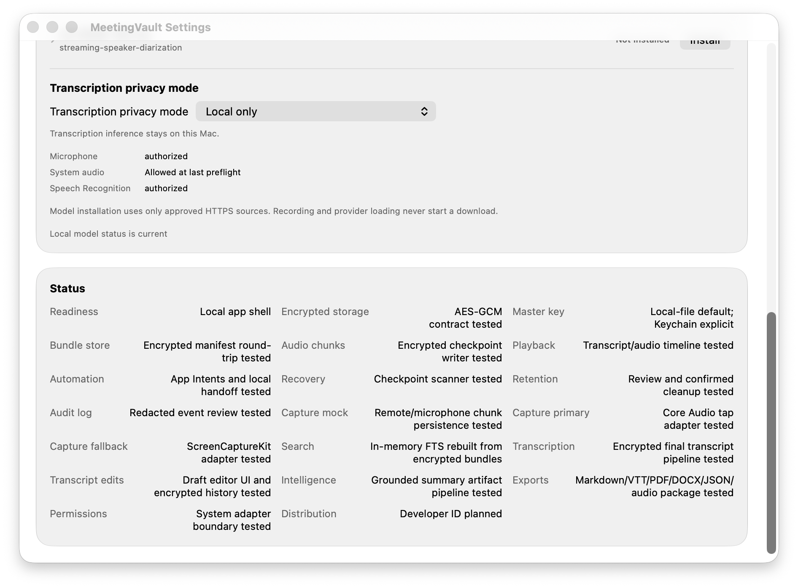

# MeetingVault

MeetingVault is a native, privacy-focused macOS app for consent-aware meeting recording, live and final transcription, encrypted local storage, search, playback, export, recovery, and transcript-grounded intelligence.

The complete app is open source under Apache-2.0. Official builds are distributed directly through GitHub Releases, outside the Mac App Store, and are signed with an Apple Developer ID certificate and notarized by Apple.

> MeetingVault is prerelease software. Confirm consent from every participant before recording, and follow the laws and workplace policies that apply to you.

## What it does

- Records a selected microphone and, when explicitly enabled, system audio.
- Uses Apple Speech for live and final transcription.
- Uses Apple Foundation Models for on-device titles, summaries, and transcript-grounded answers when Apple Intelligence is available.
- Stores meeting content locally in encrypted bundles.
- Supports local import, search, playback, editing, export, recovery, and reviewed Calendar, Contacts, or Reminders handoff.
- Has no developer-operated transcription or analytics backend.

Apple Speech may process recorded voice on Apple servers depending on locale, device capability, and service availability. See [PRIVACY.md](PRIVACY.md) for the complete data-flow summary.

## Screenshots

The gallery uses an isolated synthetic library; no real meeting content or private user data is shown.

| Meeting console | Recording setup |
| --- | --- |
|  |  |

| Transcript agent | Health and recovery |
| --- | --- |
|  |  |

| Mini Recorder | Confidence review |
| --- | --- |
|  |  |

| Local models and privacy |
| --- |
|  |

## Requirements

- An Apple silicon Mac
- macOS 26 or later
- Xcode command-line tools with Swift 6 or later to build from source

## Install an official build

Download the current archive and its SHA-256 file from [GitHub Releases](https://github.com/rsitech-ai/meeting-vault/releases). Verify the checksum, unzip the archive, and move `MeetingVault.app` to `/Applications`.

Official releases must pass Developer ID signing, Apple notarization, ticket stapling, and Gatekeeper verification. If macOS says an official archive is damaged or from an unidentified developer, do not bypass Gatekeeper; open an issue with the release name and macOS version.

MeetingVault 0.1 does not include an automatic updater. Watch the repository or check GitHub Releases for updates.

## Build and run from source

```bash
./script/build_and_run.sh
```

For a foreground launch smoke:

```bash
./script/build_and_run.sh --verify
```

Development launches use a file-backed local master key by default so rebuilt ad-hoc apps do not repeatedly trigger Keychain prompts. Use `./script/build_and_run.sh --key-provider keychain` only when intentionally testing the distribution key path.

Run the automated suite:

```bash
swift test
```

The package layout and durable data flow are summarized in [Architecture](docs/architecture.md). For permission, provider, launch, and Gatekeeper failures, see [Troubleshooting](docs/troubleshooting.md).

## Package a direct release

Release submission is explicit and fail-closed:

```bash
# Build and sign, then stop after the pre-notary archive.
script/package_release.sh --mode direct

# After review, submit with a Keychain credential profile, staple, verify,
# and create the final archive plus SHA-256 file.
script/package_release.sh \
  --mode direct \
  --notarize \
  --notarytool-profile MeetingVault-Notary
```

The first command intentionally exits blocked after producing the notarization archive. The second command is the only repository workflow that submits to Apple. See [RELEASING.md](RELEASING.md) for setup and verification.

## Project status

The source is buildable and extensively tested, but a tag is a release candidate only after the evidence in [RELEASING.md](RELEASING.md) is complete. Repository checks, real-call validation, clean-machine permission QA, Developer ID signing, and Apple notarization are separate gates.

## Contributing and support

Issues and pull requests are welcome. Start with [CONTRIBUTING.md](CONTRIBUTING.md), review the [support boundary](SUPPORT.md), follow [CODE_OF_CONDUCT.md](CODE_OF_CONDUCT.md), and report vulnerabilities through the private process in [SECURITY.md](SECURITY.md). MeetingVault is maintained by [RSI Tech](https://rsitech.ai); project contact is [info@rsitech.ai](mailto:info@rsitech.ai).

MeetingVault has no paid features or license keys.

## License and marks

Copyright © 2026 Rafal Sikora.

The source is licensed under the [Apache License 2.0](LICENSE). Attribution is recorded in [NOTICE](NOTICE). “MeetingVault” and the project artwork are project identifiers; the trademark policy is in [TRADEMARKS.md](TRADEMARKS.md).
